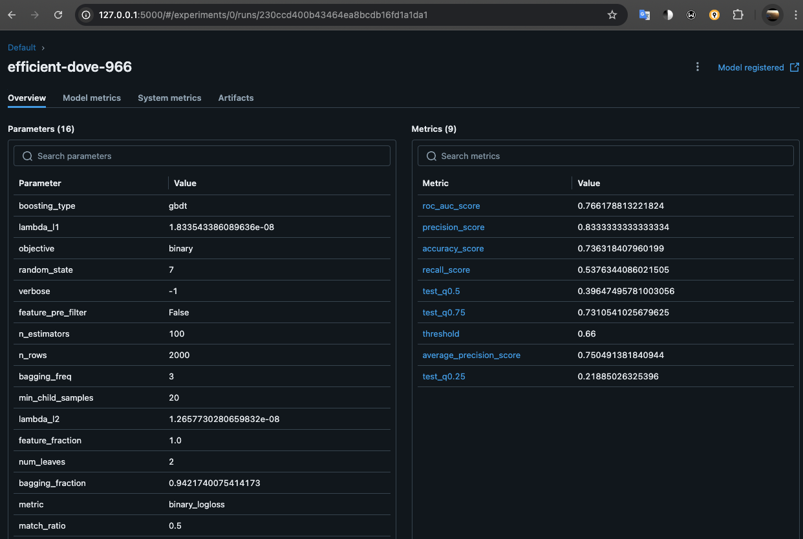
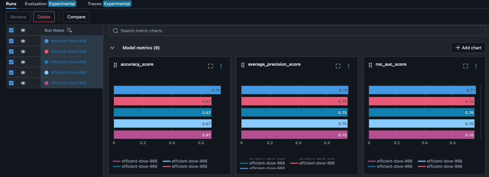
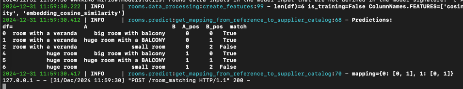
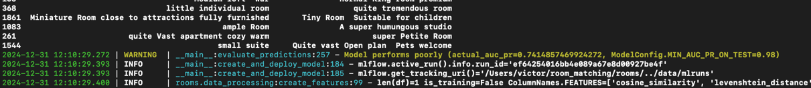
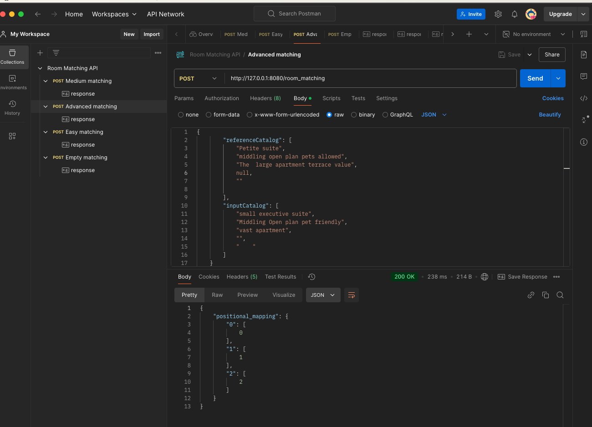
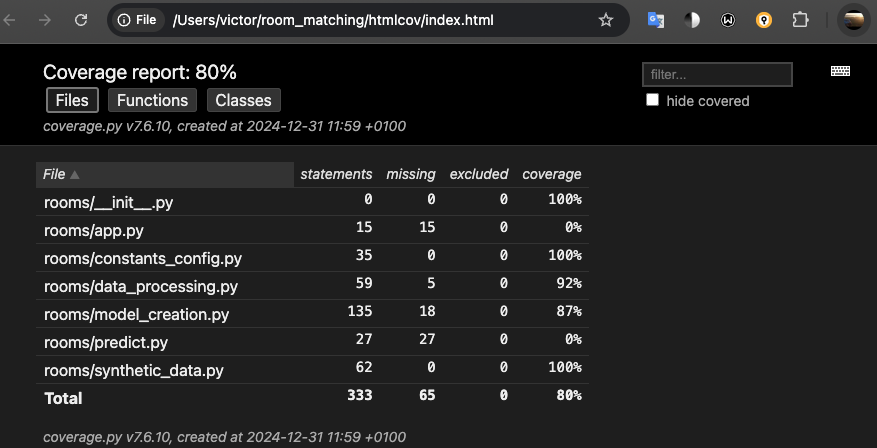

# Introduction
This project is an implementation of a room matching Build a machine learning API similar to the Cupid API’s Room Match feature. The API handles POST requests and returns sample request/response payloads in a similar format to the Cupid Room Match API. 

Internally the API uses an ML model to determine whether two pair of rooms are referring to the same room or not.

# Data Collection

A synthetic dataset is created by randomizing different room sizes, synonyms, additions. The logic of this can be found in `rooms/synthetic_data.py`.

These are some examples of rooms that do match:
```
2024-12-30 20:48:56.800 | INFO     | __main__:create_synthetic_data_and_train_model:102 - Matching examples:
                                                           A                                             B  match
1551                                            Petite suite                         small executive suite   True
678                        super humungous suite  minimalist               mammoth executive suite  Rustic   True
540                                   quite little apartment                                   Small Suite   True
1595                                         miniature suite           petite family suite  with workspace   True
422                         Vast Suite  Close to attractions                   Big suite  Easy city access   True
812   Super Spacious Open plan Suitable for children veranda      A  large Open plan suitable for children   True
1757                                        large Room value            uper colossal Room budget-friendly   True
197                                             average Room                              NORMAL ROOM CHIC   True
961                           Super Colossal Executive suite                  big executive suite Peaceful   True
334                                    a very huge Open plan            a  Ample Loft  Convenient location   True
47                               compact suite well-equipped                        Tiny Suite  minimalist   True
477                                         petite room warm                                     tiny Room   True
1052                                      quite Colossl room                            AMPLE ROOM  SERENE   True
1846                           lttle Executive suite opulent                Compact suite  family-friendly   True
1772                            little queen room economical                         a  Compact room cheap   True
845                                       GIGANTI ROOM HOMEY                             Immense King room   True
257                                   SUPER BIG FAMILY SUITE                      a  Colossal suite  roomy   True
897                                  Large studio minimalist                                     Vast loft   True
1269                                      the  gigantic room                      a Quite big Room  Luxury   True
1822                             Middling Loft All amenities  A  Moderate Loft Modern conveniences Terrace   True
```

These are some examples of room pairs that do not match:

```
2024-12-30 20:48:56.802 | INFO     | __main__:create_synthetic_data_and_train_model:103 - Non-matching examples:
                                             A                                        B  match
1272                              compact Room                HUMUNGOUS INDIVIDUAL ROOM  False
21          miniature Room Well-equipped Roomy   very Miniature queen room Pet-friendly  False
1719            the  Enormous Suite minimalist                humungous studio  premium  False
624                       Humungous queen room                            moderate room  False
1218                        little room  value                  immense Room Work-ready  False
1535                Immense Room  pets welcome                    miniature room  roomy  False
1698        very Normal family suite  Tranquil                         gargantuan Suite  False
1616              the super bi Executive suite              big family suite work-ready  False
357        MAMMOTH EXECUTIVE SUITE  MINIMALIST                               LARGE UITE  False
1748               petite double room  terrace  humungous king room convenient location  False
826   Large family suite warm Easy city access                   Quite Normal open plan  False
1812                      little Loft  balcony                 A  Immense room peaceful  False
282                             moderate suite                       A  Tremendous Room  False
209                                Petite loft                  average Kin room  Roomy  False
1892    immense loft kid-friendly pets allowed              Normal Family suite  serene  False
3                       tremendous double room                 huge queen room spacious  False
506                              moderate room                          super huge Room  False
939           the  miniature suite  minimalist                 Very normal family suite  False
391                  The  Tiny executive suite                           HUMUNGOUS LOFT  False
954                  temendous queen room Warm                              tiny studio  False
```

## Next steps
1. Do some extra iterations on the synthetic data augmentation. Include different techniques like accent variations and different languages.
2. Use real cases. Probably at some point we would have access to existing dataset examples of pairs that should(not) match. It would be good to use them as training dataset and even augment these real examples with some random word spinning/additions

# Data processing
From `rooms/data_processing.py`
## Preprocessing
These are the steps used to transform the raw input strings to normalized strings:
1. Fill any missing values with empty strings. This ensures that all elements in the Series are strings, preventing errors in subsequent string operations.
1. Convert all strings to lowercase. This helps standardize the text and makes comparisons case-insensitive.
1. Removes any characters that are not alphanumeric (a-z, A-Z, 0-9) or whitespace. This step helps clean the text by removing punctuation, special characters, and other non-alphanumeric symbols.

## Feature-extraction
Each pair of normalized room names is represented with four different features to the downstream ML model. Each feature captures different types of patterns that should give enough formation to determine whether the two rooms are the same (match) or not.

1. `cosine_similarity`. This is a string distance that will be useful when some words in one room name appear (or not) in the other. Steps:
   1. TFIDF representation is calculated for each room name
   2. cosine similarity is calculated between each two TFIDF vectors.
3. `levenshtein_distance`. A type of string edit distance that contemplates insertions, deletions and substitutions. Useful when the words are not exactly the same, but similar. Especially useful in cases like "...with a nice view" vs "...with nice views" (singular/plural variations) or "excutive suite" vs "executive suite" (typos)
4. `jaro_winkler_similarity`. A type of string edit distance that contemplates transpositions and that gives more weight to matching characters at the beginning of the strings.
5. `embedding_cosine_similarity`. A string distance metrix that captures semantic similarity, for example in "affordable" vs "cheap". It uses a pretrained transformer based architecture called MiniLM, which is a smaller version (80mb) of the BERT model. It's pre-trained on a massive dataset of text using a self-supervised contrastive learning objective. This training process teaches the model to generate similar embeddings for sentences with similar meanings and different embeddings for sentences with different meanings. This model is fetched from hugging face and is used like this:
   1. Get embeddings for each room name
   2. cosine similarity is calculated between each two embedding vectors.

## Explainability
As part of the training the feature importances are calculated by counting how many times each feature is used by the trees in the model. Example (from `notebooks/model_creation.ipynb`):
```commandline
2024-12-31 12:09:40.713 | INFO     | rooms.model_creation:get_trained_model:351 - Feature importances:
                       Feature  Importance
3  embedding_cosine_similarity         947
2      jaro_winkler_similarity         913
0            cosine_similarity         590
1         levenshtein_distance         550
```
So we see that the most powerful feature seems to be `embedding_cosine_similarity`, followed by `jaro_winkler_similarity`

### Next steps
Local explanation are very easy to get with lightgbm, we just have to pass `predict_contrib=True` to the predict method, and we get the shapley values. However, this was not deemed necessary for now. It could be done in the future if needed

# Model development
From `rooms/model_creation.py`

LightGBM was used for the binary classification task.
Model development is done by first randomly spliting the full dataset into train validation and test sets.

## Hyperparameter tuning
First, Hyperparamter optimization is done on both the train and validation sets (see `notebooks/hyperparameter_tuning_lgbm.ipynb`). The technique used is a pre-built routine in the `optuna` package specifically made for lightgbm where these hyperparameters are optimized in a stepwise manner: `lambda_l1`, `lambda_l2`, `num_leaves`, `feature_fraction`, `bagging_fraction`, `bagging_freq` and `min_child_samples`.

At the end of this step we know which are the best hyperparameters to use for the final training.

## Training the final model
Train set is used to train the LightGBM model.

Validation set is used to
1. Determine the stopping criteria of training to limit model complexity and avoid overfitting
1. Determine the threshold to be used to achieve a given minimum precision. A minimum precision on the validation set was fixed at 80%


## Evaluation

Test set is used to calculate the final evaluation. Different metrics are calculated and logged to MLflow but these are the main ones:
1. Threshold insensitive:
   1. The area under the precision recall curve is around 75%
8. Threshold sensitive (using the threshold derived from validation set):
   1. precision 78%
   1. recall 46%

## Deployment

These artificats are then stored in MLflow:
- Fitted preprocessing pipeline
- Fitted LGBM model
- Evaluation metrics



I trained a bunch of different models with default hyperparameters first and then with the tuned hyperparameters, with MLflow we can easily compare their performances. We see that the top one (tuned) is marginally better than the others, meaning that hyperparamter optimization makes the model better but it is not a game changer.



## Next steps
Automatically use the model that had the best performance instead of the last one that was uploaded (current status)

# Logging and alerting

Loguru was used for logging all the information in a concise and readable way. An example of the logs generated for example when training and deploying the model can be found in `notebooks/model_creation.ipynb`.

Loguru was used because:

* Concise and readable logging
* Automatic log rotation (rotation="10 MB")
* Retention policy (retention="10 days")
* Detailed log messages (timestamps, levels, etc.)
* Exception handling with tracebacks
* Asynchronous logging for performance
* Easy integration with Flask
* Great for tracking ML training and API monitoring

When the flask API is hit with a post request some logs are also generated:



A warning log is generated if performance measures on the test set is too low:



Where what is considered as too low is defined in the constants config file.

## Next steps
Instead of logging the warning when performance is too low, it would be preferable to send an alert via email or to the internal messaging system used in the company.

# POC Deployment - step by step guide

Flask is used (`rooms/app.py`) to create the API. These are the steps to run it.

First we have to set up the python virtual environment. For that we need tp install `poetry` and then run 
```commandline
poetry install
```

After succesfully installing all the dependencies with the previous command we now have to activate the new virtual environment, like this:
```commandline
poetry shell
```
Then we need to train the model and deploy it to MLFlow. We do that by running:
```commandline
python rooms/model_creation.py
```
Now we start the flask app to start listening to the requests. We do that by running:
```commandline
python rooms/app.py
```

And that's it, we can start hitting the API and getting results.

For how to use the API please refer to the postman collection in `Room Matching API.postman_collection.json`

After importing the collection a few example POST requests with their corresponding expected responses can be inspected. It should look like this:



# Testing

All the tests are included in `test` folder. A coverage report is provided in the `htmlcov`. Once the html is opened it should look like this:



A new report can be created by running:

```commandline
poetry run pytest --cov=rooms --cov-report=html
```

In order to run the integration test we need to have successfully run this before (so that the flask API is deployed).

```commandline
python rooms/app.py
```

## Next steps
Reach 100% test coverage

# Scalability
## Handling increased traffic

1. Load balancing: Distribute incoming traffic across multiple instances of your Flask API. This prevents any single instance from being overwhelmed. We could use load balancers like Nginx, HAProxy, or cloud-based load balancers (AWS Elastic Load Balancing, Google Cloud Load Balancing).
1. Horizontal scaling: Increase the number of Flask API instances as needed to handle the traffic. This can be done manually or automatically using auto-scaling features provided by cloud platforms.
1. Caching: Cache frequently accessed data or predictions to reduce the load on your API and improve response times. You can use in-memory caches like Redis or Memcached, or content delivery networks (CDNs) for static assets.
1. Asynchronous tasks: For long-running tasks (like model training or complex data processing), use asynchronous task queues like Celery to offload the work to background workers. This keeps your API responsive and prevents requests from being blocked.

## Handling larger datasets
1. Data partitioning: Divide your dataset into smaller chunks and distribute them across multiple machines or databases (for example using hadoop). This allows to scale your data storage and processing capabilities.
1. Distributed training: For larger models or datasets, use distributed training techniques to train your model across multiple machines. This reduces training time and allows to handle larger datasets.
1. Monitoring: Set up monitoring tools (like Prometheus or Grafana) to track API performance, resource usage, and error rates. This helps you identify bottlenecks and scale proactively.
1. Cloud platforms: Consider using cloud platforms (AWS, Google Cloud, Azure) for easier scaling and management of your infrastructure.
Containerization: Use Docker to containerize your Flask API and MLflow model for consistent deployment and easier scaling across different environments.
1. Orchestration: For complex deployments, use container orchestration tools like Kubernetes to manage and scale your containers.

By incorporating these strategies into your API design and deployment, we can ensure that it can handle increased traffic and larger datasets, providing a reliable and scalable solution for your room-matching task.


